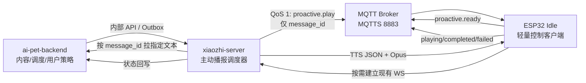
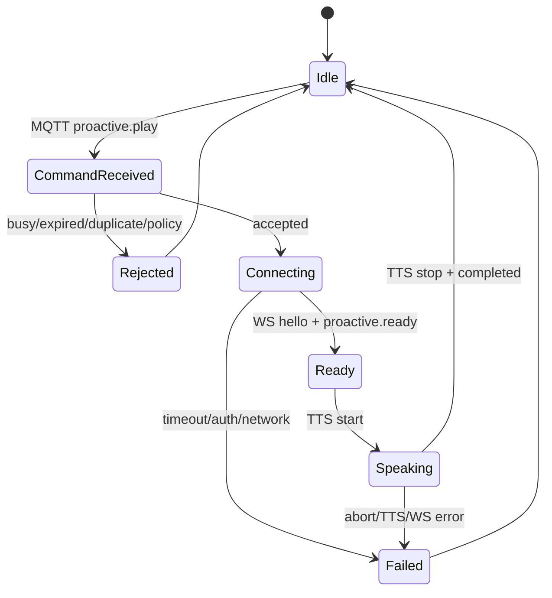

# AI Pet 主动唤醒与主动播报协作看板

> 建立日期：2026-08-18  
> 适用设备：Waveshare ESP32-P4 AI Pet 板型  
> 定位：跨固件、xiaozhi-server、ai-pet-backend、运维的设计与实施状态真源。  
> 当前阶段：方案设计，尚未修改代码、尚未部署、尚未真机验证。

## 1. 目标与边界

目标：设备处于空闲态、当前语音 WebSocket 已关闭，但仍通电、Wi-Fi 在线时，backend
可以按设备触发一条主动播报；设备收到轻量控制命令后临时建立现有语音 WebSocket，
由 xiaozhi-server 对 backend 提供的指定文本执行 TTS 并播放。

本设计中的“主动唤醒”是**远程触发设备从 Idle 进入 Connecting/Speaking**，不是：

- 远程伪造本地唤醒词；
- 唤醒断电、断网或 Wi-Fi 已关闭的设备；
- 唤醒 ESP32 深度睡眠（Deep Sleep）设备；
- 让 backend 直接控制音频、TTS 或设备 WebSocket。

首版仅支持“设备通电 + Wi-Fi 在线 + 控制通道在线”。深度睡眠唤醒需要额外硬件或
低功耗网络方案，不进入本轮。

## 2. 当前基线

| 能力 | 当前状态 | 结论 |
|------|----------|------|
| 本地唤醒词打开语音 WS | 已实现 | Idle 时由固件调用 `OpenAudioChannel()` |
| 服务端 TTS 下发 | 已实现 | 已连接的设备可接收 `tts/start`、Opus、`tts/stop` |
| Idle → Speaking 状态转换 | 固件允许 | 但前提是设备已经收到服务端消息 |
| 空闲时保持语音 WS | 不保持 | 会话结束后关闭，当前无法远程寻址 |
| xiaozhi-server 在线设备注册表 | 未实现 | 没有 `device_uid → connection` 主动发送入口 |
| backend 主动推送 | 未实现 | 当前是会话开始拉取 `persona_pack` |
| backend 指定内容 | 部分具备 | `greeting` 当前是 Prompt 引导语，不是固定 TTS |
| 公网 MQTTS | 未部署 | 8883 仅预留，域名、证书、broker、ACL 均未落地 |

已有 `MqttProtocol` 是“MQTT 控制 + 加密 UDP 音频”的完整替代协议。生产环境当前使用
WebSocket 音频服务，首版**不切换到 MQTT+UDP**，只复用其控制面思路，新增一个独立、
轻量的 MQTTS 控制客户端；音频仍走现有 WebSocket。

## 3. 方案结论

**推荐：独立 MQTTS 控制通道 + 按需建立现有 WebSocket 音频通道。**



设计原则：

1. MQTT 只传控制命令和状态，不传对话正文、Prompt、音频或密钥。
2. backend 是内容、调度、用户授权和静默时段真源。
3. xiaozhi-server 是设备路由、TTS 和语音会话真源。
4. 固件只执行经过认证、未过期且允许播放的命令。
5. 使用 `message_id` 做全链路幂等；QoS 1 允许重复投递，但不得重复播放。
6. 语音 WS 保持按需连接，避免空闲时长期占用完整会话资源。

## 4. MQTT 与常驻控制 WS 对比

这里比较的是**独立 MQTTS 控制连接**与**独立常驻控制 WebSocket**。不建议把当前承载
ASR/TTS 音频的 WebSocket 强行改成长连接控制通道，因为它与会话 UUID、ASR/TTS
实例、30 秒断连和音频状态机耦合。

| 维度 | 独立 MQTTS 控制通道 | 独立常驻控制 WS |
|------|----------------------|-----------------|
| 空闲设备寻址 | Broker 原生按 topic 路由 | 服务端维护 `device_uid → WS` 注册表 |
| 断线重连 | MQTT 客户端原生重连、会话可恢复 | 需自研退避、抖动、重连风暴保护 |
| 至少一次投递 | QoS 1 原生支持 | 需自研 ACK、重发、超时 |
| 离线短时排队 | 持久会话 + 消息过期可支持 | 默认不支持，须另建队列 |
| 去重 | 仍需按 `message_id` 实现 | 同样需要自研 |
| 水平扩展 | Broker 屏蔽连接归属 | 需要 sticky session 或共享连接路由 |
| 服务端复杂度 | 增加 broker、ACL、证书和运维 | 不加 broker，但业务服务连接管理复杂 |
| 固件复杂度 | 增加第二 MQTT 客户端或轻量控制组件 | 增加第二 WS 客户端和心跳协议 |
| RAM/Socket | MQTT 通常更轻，但须实测双连接预算 | WS/TLS 常驻开销通常更高 |
| NAT/心跳 | MQTT keepalive 成熟 | 需自行定义 ping/pong 与超时 |
| 安全模型 | 每设备凭据 + topic ACL 清晰 | 每设备 token + 服务端路由鉴权 |
| 消息模型 | 非常适合命令/事件/状态 | 适合高频双向实时交互 |
| 调试门槛 | 多一个 broker 和 topic 工具 | HTTP/WS 工具更直接 |
| 与现有生产音频 WS | 解耦，互不改变生命周期 | 解耦，但仍需新增 WS endpoint |
| 域名/证书依赖 | 需要 MQTTS 8883 | 需要 WSS 443 |

### 4.1 独立 MQTTS 的优点

- QoS、重连、会话恢复、消息过期、LWT 和 topic ACL 都有成熟语义。
- 设备在线归属由 broker 管理，xiaozhi-server 不需要持有所有控制连接对象。
- 以后可复用到灯带、舵机、提醒、固件状态等低频控制事件。
- 控制面与实时音频面解耦，主动命令失败不会污染普通 ASR/LLM/TTS 会话。

### 4.2 独立 MQTTS 的代价

- 需要部署和运维 Mosquitto/EMQX、证书、每设备凭据、ACL 和监控。
- 固件当前生产配置选择 WebSocket；新增控制 MQTT 不能直接复用当前
  `protocol_` 单例，需要独立组件，并验证双 TLS 连接、socket、RAM 和重连行为。
- QoS 1 不是“只执行一次”，固件和服务端仍必须做幂等。
- retained 消息可能造成重启后误播，主动播放命令**禁止 retained**。
- 当前域名、ICP、TLS 尚未完成，公网 8883 是上线前置。

### 4.3 常驻控制 WS 的优点

- 可以复用现有 JSON、鉴权和 Python WebSocket 技术栈，MVP 服务端组件较少。
- 命令延迟低，协议调试直观。
- 若设备规模很小且不要求离线排队，初版实现速度可能更快。

### 4.4 常驻控制 WS 的代价

- 在线连接表、跨进程路由、ACK、重试、消息过期、离线队列都要自行实现。
- 多实例部署必须增加 Redis/NATS 等共享路由，最终仍会引入消息基础设施。
- 大量设备断网重连时，服务端需自行处理重连风暴和连接泄漏。
- 常驻 WSS/TLS 的内存和心跳开销通常高于轻量 MQTT，须真机测量。
- 不能解决断电、断网和 Deep Sleep。

### 4.5 推荐理由

主动播报属于低频、要求可靠投递和明确状态的“命令/事件”问题，而不是持续高频双向
会话问题。MQTT 更符合控制面；现有 WS 更符合按需音频面。虽然 MQTT 首期运维成本
更高，但不会把连接路由、离线队列和重试逻辑堆进 xiaozhi-server，长期边界更清晰。

若必须在没有域名/MQTTS 的内网原型阶段快速验证，可临时做独立控制 WS Spike；
该 Spike 只验证状态机和按需打开音频 WS，不作为生产传输定案。

## 5. 命令与回执草案

> 以下是协作草案，不是最终契约。落地前必须先更新
> `xiaozhi-server/docs/05-与业务后端集成接口.md` 和
> `ai-pet-backend/docs/06-HTTP-API规范.md`，路径与字段只保留一套，不做双写兼容。

### 5.1 Topic

```text
aipet/v1/devices/{device_uid}/commands
aipet/v1/devices/{device_uid}/events
```

`device_uid` 使用规范化小写冒号 MAC。broker ACL 要求设备只能订阅自己的 commands，
只能发布自己的 events。

### 5.2 主动播放命令

```json
{
  v: 1,
  type: proactive.play,
  message_id: UUID,
  issued_at: ISO-8601,
  expires_at: ISO-8601,
  priority: normal,
  interrupt_policy: idle_only
}
```

MQTT 不携带播放正文。设备收到后，以 `message_id` 建立现有语音 WS；xiaozhi-server
再通过内部接口从 backend 拉取指定文本，避免敏感内容进入 broker、固件日志或 retained
消息。

### 5.3 设备事件

```json
{
  v: 1,
  type: proactive.status,
  message_id: UUID,
  state: received|accepted|channel_opened|playing|completed|rejected|failed|expired,
  reason: idle|busy|quiet_hours|duplicate|ws_failed|tts_failed,
  ts: ISO-8601
}
```

### 5.4 WS 扩展

设备因主动命令建立语音 WS 后发送：

```json
{
  type: proactive,
  state: ready,
  message_id: UUID
}
```

xiaozhi-server 校验设备 UID、消息归属、有效期和幂等状态后，直接将指定文本送入 TTS；
首版绕过 LLM，保证播放内容确定。普通本地唤醒流程不发送此消息，行为保持不变。

## 6. 状态机



首版 `interrupt_policy` 固定 `idle_only`：

- Idle：允许主动播放。
- Connecting/Listening/Speaking：返回 `busy`，不打断用户会话。
- WifiConfiguring/Activating/Upgrading/FatalError：拒绝。
- 到期、重复或本地免打扰：拒绝且不打开语音 WS。

## 7. 可靠性、安全与隐私

- MQTTS TLS 必选；生产禁止明文 1883。
- 每设备独立凭据或短期凭据，禁止全设备共享密码。
- broker topic ACL 最小授权；服务端发布端与设备端身份分离。
- 命令 QoS 1、`retain=false`、设置消息过期；禁止永久离线积压。
- 固件保存最近已完成 `message_id` 的有界去重窗口；重启后至少保留最近若干条。
- backend 持久化业务状态；xiaozhi-server 只保留短期路由状态，不成为业务真源。
- 日志只记录 message_id、device_uid、状态、耗时和失败原因，不记录播放正文或 token。
- 用户必须显式开启主动播报，并支持静默时段、频率上限、音量上限和一键关闭。
- 内容进入 TTS 前执行长度、敏感内容和来源校验；首版限制单条 1～2 句。
- 设备本地按键、唤醒词和用户对话优先级高于主动播报。

## 8. 跨仓任务看板

状态：`未开始 / 设计中 / 开发中 / 已部署 / 已验收 / 阻塞`

| ID | 负责侧 | 任务 | 交付物 | 状态 |
|----|--------|------|--------|------|
| P0 | 产品 | 拍板主动播报开关、静默时段、频率、音量、内容类型 | 产品规则 | 未开始 |
| A0 | 架构 | 采用独立 MQTTS 控制 + 现有 WS 音频 | 本文评审结论 | 设计中 |
| O1 | 运维 | 域名/证书/MQTTS 8883；部署 broker | 脱敏配置与监控 | 阻塞：域名/TLS |
| O2 | 运维 | 每设备凭据、ACL、轮换、LWT、消息过期 | 安全基线 | 未开始 |
| B1 | backend | 主动消息表/Outbox、内容、调度、静默策略、幂等 | 迁移 + worker | 未开始 |
| B2 | backend | 指定内容读取与状态回写内部契约 | docs/06 + API | 未开始 |
| X1 | xiaozhi-server | MQTT publisher/status consumer 与 pending 路由 | 控制面适配器 | 未开始 |
| X2 | xiaozhi-server | 处理 `proactive.ready`，拉文本并直接 TTS | WS 扩展 + TTS 编排 | 未开始 |
| X3 | xiaozhi-server | BIZ 日志、超时、失败回写、幂等与限流 | 可观测性 | 未开始 |
| F1 | 固件 | 独立控制客户端生命周期，不替换现有 `protocol_` | control client | 未开始 |
| F2 | 固件 | 命令校验、去重、状态机、WS 主动连接与回执 | proactive handler | 未开始 |
| F3 | 固件 | 本地免打扰、用户优先、失败回 Idle | 策略与 UI/串口状态 | 未开始 |
| F4 | 固件 | 测量双 TLS 连接 RAM/socket/功耗/重连 | 测试记录 | 未开始 |
| E1 | 联调 | 在线、离线重连、重复、过期、busy、静默时段 | E2E 证据 | 未开始 |

## 9. 分阶段实施

### Phase 0：技术 Spike

1. 内网 broker + 单设备测试凭据。
2. 固件 Idle 保持控制 MQTT，验证 30 分钟稳定和自动重连。
3. 收到测试命令后仅打印串口并回 ACK，不播放。
4. 测量 heap、socket、Wi-Fi 功耗；不自动运行 `idf.py build`，由用户手工完成。

通过后才进入正式协议开发。

### Phase 1：设备主动打开现有 WS

1. `proactive.play` 到达后从 Idle 进入 Connecting。
2. 打开现有 WebSocket，发送 `proactive.ready`。
3. 服务端先返回固定测试短句，播放结束回 Idle。
4. 保证本地唤醒、普通对话、休息断开均无回归。

### Phase 2：backend 指定内容闭环

1. backend 创建消息与调度任务。
2. xiaozhi-server 按 message_id 拉取正文并执行 TTS。
3. 全状态回写 backend。
4. 加入用户开关、静默时段、频率和长度限制。

### Phase 3：生产化

1. MQTTS、ACL、凭据轮换、监控和告警。
2. 离线短时投递、过期、重复和重连风暴测试。
3. 多设备并发、服务重启、broker 重启和网络抖动测试。
4. 完成安全评审和真机验收后再默认开启。

## 10. 验收标准

- 设备空闲且语音 WS 已关闭至少 5 分钟，收到命令后 5 秒内开始播放。
- 播放文本与 backend 指定文本语义一致；首版绕过 LLM，不添加自由发挥内容。
- 同一 `message_id` 重复投递 10 次只播放一次。
- 已过期、静默时段、用户关闭、设备 busy 时均不播放，并返回明确状态。
- 控制 MQTT 断开后自动重连；有效期内消息按策略恢复，过期消息不补播。
- 主动播放失败后设备回 Idle，本地唤醒仍可立即建立普通会话。
- 主动播放不得打断用户正在进行的 Listening/Speaking 会话。
- broker 拒绝跨设备 topic 订阅/发布；日志中无正文、密码、token。
- 连续 24 小时空闲控制连接无明显 heap 泄漏、socket 泄漏或重连风暴。

## 11. 待决事项

| 事项 | 建议 | 状态 |
|------|------|------|
| 产品名称 | UI 用“主动播报/定时提醒”，技术层用 `proactive.play`，避免误解为 WakeNet | 待拍板 |
| Broker | MVP Mosquitto；需要规则引擎/大规模管理时再评估 EMQX | 待运维评估 |
| 设备凭据下发 | 复用 OTA/激活链路下发独立 MQTT 凭据，不硬编码 | 待契约 |
| 离线消息最长保留 | 建议 5～15 分钟，超过即 expired | 待产品拍板 |
| 忙碌策略 | 首版 `idle_only`，不打断、不排队到当前对话结束 | 建议已给出 |
| 文本还是 Prompt | 首版 exact text 直送 TTS；自然发挥另设显式 mode | 待产品拍板 |
| 控制 WS Spike | 仅在 MQTTS 前置长期阻塞时做，不作为生产默认 | 待排期 |
| Deep Sleep | 不在本轮；若未来需要，单独评估 ULP/外部唤醒/蜂窝推送 | 明确不做 |

## 12. 进度日志

| 日期 | 侧 | 事项 |
|------|----|------|
| 2026-08-18 | 架构 | 完成空闲设备主动播报方案分析；推荐独立 MQTTS 控制面 + 现有 WS 音频面，建立跨仓任务与验收清单。 |
